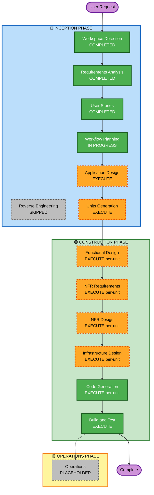

# Execution Plan

## Detailed Analysis Summary

### Project Type
**Greenfield Project** - 완전히 새로운 테이블오더 서비스 구축

### Change Impact Assessment

#### User-facing changes
**Yes** - 두 가지 주요 사용자 인터페이스 구축:
- 고객용 주문 인터페이스 (테이블 태블릿)
- 관리자용 관리 인터페이스 (대시보드)

#### Structural changes
**Yes** - 전체 시스템 아키텍처 설계:
- 클라이언트-서버 아키텍처
- 실시간 통신 (Server-Sent Events)
- 세션 관리 시스템
- 데이터베이스 스키마 설계

#### Data model changes
**Yes** - 새로운 데이터 모델 설계 필요:
- 매장 (Store)
- 테이블 (Table)
- 메뉴 (Menu)
- 카테고리 (Category)
- 주문 (Order)
- 주문 항목 (OrderItem)
- 사용자 (User - 관리자)
- 세션 (Session)

#### API changes
**Yes** - 전체 REST API 설계:
- 고객용 API (메뉴 조회, 주문 생성, 주문 조회)
- 관리자용 API (인증, 주문 관리, 테이블 관리, 메뉴 관리)
- 실시간 API (SSE 엔드포인트)

#### NFR impact
**Yes** - 명확한 비기능 요구사항:
- 성능: 1초 이내 응답 시간
- 동시성: 10-50명 동시 사용자 지원
- 보안: bcrypt + JWT + HTTPS 권장
- 실시간: SSE를 통한 2초 이내 주문 표시

### Risk Assessment
- **Risk Level**: Medium
- **Rationale**: 
  - 새 프로젝트로 기존 시스템 영향 없음 (위험 감소)
  - 실시간 통신 및 세션 관리의 복잡성 (위험 증가)
  - 명확한 요구사항 및 user stories (위험 감소)
- **Rollback Complexity**: Easy (새 시스템이므로 전체 롤백 가능)
- **Testing Complexity**: Moderate (단위 테스트 + 통합 테스트 + 실시간 통신 테스트)

---

## Workflow Visualization

---

## Phases to Execute

### 🔵 INCEPTION PHASE

#### Completed Stages
- [x] **Workspace Detection** (COMPLETED)
  - Status: Greenfield project identified
  - Artifacts: aidlc-state.md, audit.md

- [x] **Reverse Engineering** (SKIPPED)
  - Rationale: Greenfield project - no existing codebase to analyze

- [x] **Requirements Analysis** (COMPLETED)
  - Status: Comprehensive requirements documented
  - Artifacts: requirements.md, requirement-verification-questions.md
  - Tech Stack: Node.js, React, PostgreSQL, AWS

- [x] **User Stories** (COMPLETED)
  - Status: 11 user stories and 2 personas created
  - Artifacts: stories.md, personas.md
  - Organization: User Journey-Based

- [x] **Workflow Planning** (IN PROGRESS)
  - Status: Creating execution plan
  - Artifacts: execution-plan.md

#### Stages to Execute

- [ ] **Application Design** - **EXECUTE**
  - **Rationale**: 
    - 새로운 컴포넌트와 서비스 설계 필요
    - Component methods와 business rules 정의 필요
    - Service layer 아키텍처 설계 필요
    - Client-Server 컴포넌트 간 dependencies 명확화 필요
  - **Expected Artifacts**:
    - Component identification (Frontend, Backend, Database)
    - Service layer design
    - Component methods and business rules
    - Component interaction diagrams

- [ ] **Units Generation** - **EXECUTE**
  - **Rationale**:
    - 복잡한 시스템을 여러 units of work로 분해 필요
    - 병렬 개발 가능하도록 독립적인 units 식별
    - Frontend UI, Backend API, Database Schema 등 다양한 관심사 분리
  - **Expected Artifacts**:
    - Unit-of-work breakdown
    - Unit dependencies
    - Story-to-unit mapping

---

### 🟢 CONSTRUCTION PHASE

#### Per-Unit Design Stages (각 unit마다 반복)

- [ ] **Functional Design** - **EXECUTE** (per-unit)
  - **Rationale**:
    - 새로운 데이터 모델과 스키마 설계 (Store, Table, Menu, Order, etc.)
    - 복잡한 비즈니스 로직 설계 (주문 생성, 세션 관리, 장바구니 로직)
    - State management 전략 정의 (클라이언트 측 상태, 서버 측 상태)
    - 각 unit의 상세 기능 설계 필요
  - **Expected Artifacts** (per unit):
    - Data models and schemas
    - Business logic specifications
    - State management design
    - Algorithms and workflows

- [ ] **NFR Requirements** - **EXECUTE** (per-unit)
  - **Rationale**:
    - 명확한 성능 요구사항 (1초 이내 응답 시간)
    - 보안 고려사항 (bcrypt, JWT, 세션 관리, HTTPS)
    - 확장성 요구사항 (10-50명 동시 사용자)
    - 실시간 통신 요구사항 (SSE, 2초 이내 업데이트)
    - 로깅 및 모니터링 (CloudWatch)
  - **Expected Artifacts** (per unit):
    - NFR assessment for the unit
    - Technology stack selection
    - Performance targets
    - Security requirements
    - Scalability considerations

- [ ] **NFR Design** - **EXECUTE** (per-unit)
  - **Rationale**:
    - NFR Requirements에서 식별된 요구사항을 구체적인 설계로 전환
    - NFR 패턴 및 logical components 정의
    - 각 unit의 NFR 구현 전략 수립
  - **Expected Artifacts** (per unit):
    - NFR patterns and approaches
    - Logical component design
    - NFR implementation strategy

- [ ] **Infrastructure Design** - **EXECUTE** (per-unit)
  - **Rationale**:
    - AWS 배포 환경 설계 필요
    - 실제 infrastructure services 매핑 (EC2, RDS, CloudWatch 등)
    - Deployment architecture 정의
    - 각 unit의 인프라 요구사항 명세
  - **Expected Artifacts** (per unit):
    - Infrastructure architecture
    - AWS services mapping
    - Deployment specifications
    - Configuration requirements

#### Always-Execute Stages

- [ ] **Code Generation** - **EXECUTE** (ALWAYS, per-unit)
  - **Rationale**: 각 unit의 코드 구현 필요
  - **Process**: Part 1 (Planning) → Part 2 (Generation)
  - **Expected Artifacts** (per unit):
    - Source code
    - Unit tests
    - Configuration files
    - Documentation

- [ ] **Build and Test** - **EXECUTE** (ALWAYS)
  - **Rationale**: 모든 units 빌드 및 종합 테스트 필요
  - **Expected Artifacts**:
    - Build instructions
    - Unit test results
    - Integration test results
    - Test summary report

---

### 🟡 OPERATIONS PHASE

- [ ] **Operations** - **PLACEHOLDER**
  - **Rationale**: 향후 배포 및 모니터링 워크플로우 확장을 위한 자리 표시
  - **Current State**: 모든 빌드 및 테스트 활동은 CONSTRUCTION 단계에서 처리

---

## Execution Summary

### Total Stages to Execute: 10
- INCEPTION: 2 stages (Application Design, Units Generation)
- CONSTRUCTION: 8 stages (6 per-unit design stages + Code Generation + Build and Test)

### Total Stages to Skip: 2
- Reverse Engineering (Greenfield)
- Operations (Placeholder)

### Estimated Timeline
Based on complexity and scope:
- **INCEPTION Phase**: Application Design (진행 중) → Units Generation
- **CONSTRUCTION Phase**: Per-unit loop (design + code) → Build and Test
- **Total Duration**: 이 단계들을 순차적으로 진행

---

## Success Criteria

### Primary Goal
테이블오더 서비스의 MVP 버전 구축:
- 고객이 테이블 태블릿에서 메뉴를 조회하고 주문 생성
- 관리자가 실시간으로 주문을 모니터링하고 관리

### Key Deliverables
1. ✅ Requirements 문서 (완료)
2. ✅ User Stories 및 Personas (완료)
3. ⏳ Application Design (다음 단계)
4. ⏳ Units Breakdown (다음 단계)
5. ⏳ Functional Design per unit
6. ⏳ NFR Design per unit
7. ⏳ Infrastructure Design per unit
8. ⏳ Working Code (Frontend + Backend + Database)
9. ⏳ Tests (Unit + Integration)
10. ⏳ Build and Test Instructions

### Quality Gates
- ✅ All 9 functional requirements covered by user stories
- ✅ 100% requirements-to-stories traceability
- ⏳ All components designed and documented
- ⏳ All NFRs addressed in design
- ⏳ Code passes unit tests
- ⏳ Integration tests validate end-to-end workflows
- ⏳ Performance targets met (1초 응답, 2초 실시간 업데이트)

---

## Next Steps

**Immediate Next Stage**: Application Design
- Component identification
- Service layer design
- Component methods and business rules
- Component interaction diagrams

After Application Design, proceed to Units Generation to break down the work into manageable units for parallel development.
